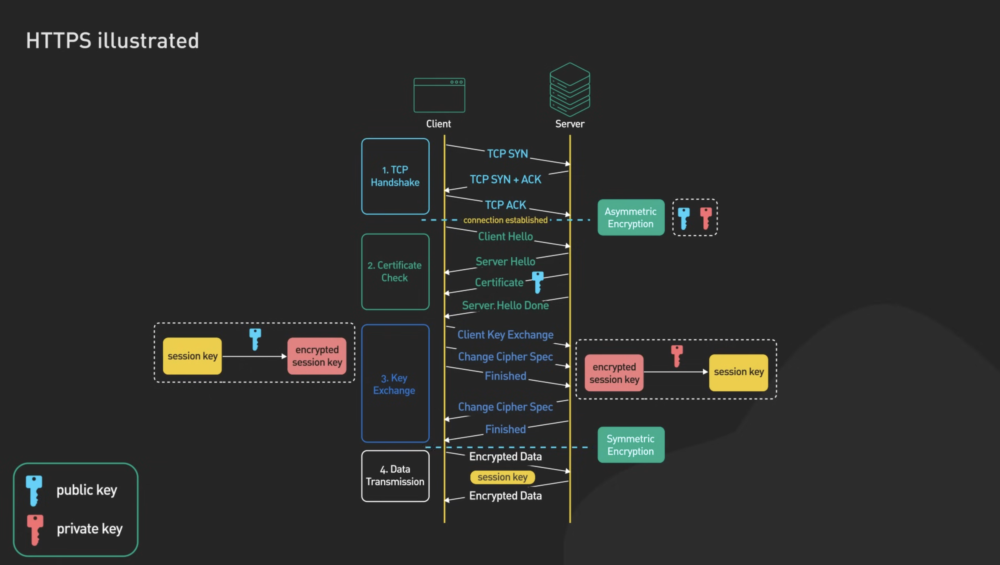

# Asymmetric Cryptopgraphy

Before introducing the **asymmetric key encryption** schemes and algorithms, we should first understand the concept of **public key cryptography** (asymmetric cryptography).

The [**public key cryptography**](https://en.wikipedia.org/wiki/Public-key\_cryptography) uses a different key to **encrypt** and **decrypt** data (or to sign and verify messages). Keys always come as **public + private key pairs**. **Asymmetric cryptography** deals with **encrypting** and **decrypting** messages using a public / private key, **signing** messages, **verifying** signatures and securely **exchanging keys**.


Popular **public-key cryptosystems** (asymmetric crypto algorithms) like **RSA** (Rivest–Shamir–Adleman), **ECC** (elliptic curve cryptography), **Diffie-Hellman**, **ECDH**, **ECDSA** and **EdDSA**, are widely used in the modern cryptography and we shall demonstrate most of them in practice with code examples.


**Asymmetric encryption** is slower and less efficient than symmetric encryption, but it is more secure for certain applications, such as secure communication over the internet.


## Key Pairs

**Asymmetric encryption schemes** use a pair of cryptographically related **public** and **private keys** to **encrypt** the data (by the public key) and **decrypt** the encrypted data back to its original forms (by the private key). Data **encrypted by a public key** is **decrypted** by the corresponding **private key**.

The encrypted data, obtained as result of encryption is called *ciphertext*. The *ciphertext* is a binary sequence, unreadable by humans and by design cannot be decrypted without the decryption key.

!!! note

    Public key encryption can work also in the opposite scenario: **encrypt data by a private key and decrypt it by the public key**. Thus someone can prove that he is owner of certain private key, while revealing only its corresponding public key. This approach is used by some **digital signature** schemes.

In some public key cryptosystems (like the Elliptic-Curve Cryptography - **ECC**), the public key can be calculated from the private key. In other cryptosystems (like **RSA**), the public key and the private key are generated together but cannot be directly calculated from each other.

Usually, a **public / private key pair** is randomly generated in a secure environment (e.g. in a hardware wallet) and the public key is revealed, while the private key is securely stored in a crypto-wallet and is protected by a password or by multi-factor authentication.

**Example** of 256-bit private key and its corresponding 256-bit public key (based on **secp256k1** curve):

```
privKey: 648fc1fa828c7f185d825c04a5b21af9e473b867eeee1acea4dbab938433e158
pubKey: 02c324648931b89e3e8a0fc42c96e8e3be2e42812986573a40d46563bceaf75110
```

### Private Keys

Message **decryption** and **signing** is done by a **private key**. The private keys are always kept **secret** by their owner, just like passwords. In the server infrastructure, private key usually stay in an encrypted and protected **keystore**. In the blockchain systems the private keys usually stay in specific software or hardware apps or devices called "**crypto wallets**", which store securely a set of private keys.

**Example** of 256-bit private key:

```
648fc1fa828c7f185d825c04a5b21af9e473b867eeee1acea4dbab938433e158
```

### Public Keys

Message **encryption** and **signature verification** is done by the **public key**. Public keys are by design public information (not a secret). It is mathematically infeasible to calculate the private key from its corresponding public key.

In many systems the **public key** is encapsulated in a **digital certificate**, which binds certain identity (e.g. person or Internet domain name) to certain public key. In blockchain systems public keys are usually published as parts of the blockchain transactions to help identify who has signed each transaction. In systems like PGP and SSH the public key is downloaded from the server once (after manual user verification) and is remembered for further use.

**Example** of 256-bit public key:

```
02c324648931b89e3e8a0fc42c96e8e3be2e42812986573a40d46563bceaf75110
```

In most blockchain systems the **blockchain address** is derived from the public key (by hashing and other transformations), so if you have someone's public key, you are assumed to have his blockchain address as well.

A certain **public key** can be connected to certain **person** or **organization** or is used anonymously. You can never know who is the owner of the private key, corresponding to certain public key, unless you have additional proof, e.g. a [**digital certificate**](https://en.wikipedia.org/wiki/Public\_key\_certificate).

## Cryptosystems

**Public key cryptosystems** provide mathematical framework and algorithms to generate public + private key pairs, to **sign**, **verify**, **encrypt** and **decrypt** messages and **exchange keys**, in a cryptographically secure way.

Well-known public-key cryptosystems are: [**RSA**](https://en.wikipedia.org/wiki/RSA\_\(cryptosystem\)), [**ECC**](https://en.wikipedia.org/wiki/Elliptic-curve\_cryptography) and [**ElGamal**](https://en.wikipedia.org/wiki/ElGamal\_encryption). Many **crypto algorithms** are based on the primitives from these cryptosystems like **RSA sign**, **RSA encrypt / decrypt**, **ECDH** key exchange and **ECDSA** and **EdDSA** signatures.

### RSA

The [**RSA public-key cryptosystem**](https://en.wikipedia.org/wiki/RSA\_\(cryptosystem\)) is based on the math of **modular exponentiations** (numbers raised to a power by modulus) and some additional assumptions, together with the computational difficulty of the [**integer factorization problem**](https://en.wikipedia.org/wiki/RSA\_problem). We shall discuss it later in details, along with examples.

### ECC

The [**elliptic-curve cryptography (ECC) public-key cryptosystem**](https://en.wikipedia.org/wiki/Elliptic-curve\_cryptography) is based on the math of the on the algebraic structure of the **elliptic curves** over finite fields and the difficulty of the [**elliptic curve discrete logarithm problem (ECDLP)**](https://en.wikipedia.org/wiki/Elliptic-curve\_cryptography#Rationale). The **ECC** usually comes together with the [**ECDSA** algorithm](https://en.wikipedia.org/wiki/Elliptic\_Curve\_Digital\_Signature\_Algorithm) (elliptic-curve digital signature algorithm). We shall discuss ECC and ECDSA in details, along with examples.

**ECC uses smaller keys**, ciphertexts and signatures than RSA and is recommended for most applications. It is mathematically proven that a **3072-bit RSA key** has similar cryptographic strength to a **256-bit ECC key**. Key generation is in ECC is significantly faster than with RSA.

Due to the above reasons most blockchain networks (like Bitcoin and Ethereum) use elliptic-curve-based cryptography (ECC) to secure the transactions.

!!! warning

    Both **RSA** and **ECC** cryptosystems are **not quantum-safe**, which means that if someone has enough powerful quantum computer, he will be able to derive the private key from given public key in just few seconds.

## Encryption/Decryption

**Asymmetric encryption** works for **small messages** only (limited by the public / private key length). To encrypt larger messages [**key encapsulation mechanisms**](https://en.wikipedia.org/wiki/Key\_encapsulation) or other techniques can be used, which encrypt asymmetrically a random secret key, then use it to symmetrically encrypt the larger messages. In practice, modern **asymmetric encryption schemes** involve using a symmetric encryption algorithm together with a public-key cryptosystem, key encapsulation and message authentication.

Popular **asymmetric encryption schemes** are: [**RSA-OAEP**](https://en.wikipedia.org/wiki/Optimal\_asymmetric\_encryption\_padding) (based on RSA and OAEP padding), [**RSAES-PKCS1-v1\_5**](https://tools.ietf.org/html/rfc3447#section-7.2) (based on RSA and PKCS#1 v1.5 padding), [**DLIES**](https://en.wikipedia.org/wiki/Integrated\_Encryption\_Scheme) (based on discrete logarithms and symmetric encryption) and [**ECIES**](https://en.wikipedia.org/wiki/Integrated\_Encryption\_Scheme) (based on elliptic curve cryptography and symmetric encryption).

### Key encapsulation mechanism (KEM)

Typically, public-key crypto systems can **encrypt messages of limited length** only and are **slower** than symmetric ciphers. For encrypting longer messages (e.g. PDF documents) usually a **public-key encryption scheme** (also known as **hybrid encryption scheme**) is used, which combines **symmetric** and **asymmetric encryption**


[**Key encapsulation mechanism (KEM)**](https://en.wikipedia.org/wiki/Key\_encapsulation): encapsulate an asymmetrically-encrypted random (ephemeral) symmetric key and use symmetric algorithm for the data encryption.

* For the **encryption** a random symmetric key `sk` is generated, the message is symmetrically encrypted by `sk`, then `sk` is asymmetrically encrypted using the recipient's public key.
* For **decryption**, first the `sk` key is asymmetrically decrypted using the recipient's private key, then the ciphertext is decrypted symmetrically using `sk`.

### Asymmetric vs Symmetric

Symmetric and asymmetric encryption are two different types of encryption that are used in various applications. Symmetric is faster and more efficient, perfect for handling large amounts of data. On the other hand, asymmetric encoding offers greater security as parties do not need to exchange their secret keys.

!!! note

    Asymmetric encryption is less common than symmetric encryption, but it is growing in popularity. It is used in applications where security is critical, such as online banking and cryptocurrency. The most popular asymmetric algorithm is the RSA algorithm, and RSA 2048 is the strongest asymmetric algorithm available.

In order to decide wether using one type of another, here is a table with its main differences.


## Digital Signatures

A **digital signature** is an **unique** and **non-transferable** electronic **seal** that links an **individual or entity** to a **digital document or message**. It works similarly to a **traditional handwritten signature**, but using **advanced cryptographic techniques** to ensure the **authenticity**, **integrity** and **confidentiality** of the information.

* **Authentication**, by serving as a **credential** to **validate** the identity of the **entity that it is issued to**.
* **Encryption**, for **secure communication** over **insecure networks** such as the internet.
* **Integrity** of **documents signed with the certificate** so that they **cannot be altered** by a third party in **transit**.

!!! warning

    The **legitimacy** of** digital signatures** are dependent on the **certificate** that authenticates the **content** and the **signer**. There are various reputable and legitimate digital **certifying authorities (CA)** that allow companies to obtain digital certificates.


**Digital signatures** in short: a message can be **signed** by certain **private key** and the obtained **signature** can be later **verified** by the corresponding **public key**. A **signed message** cannot be altered after signing. A message signature proves that certain message (e.g. blockchain transaction) is created by the owner of certain public key.

!!! note

    The **digital document** or **message** is not directly **signed**, instead a **hash digest** (i.e `SHA-256`) is calculated and used to generate the **digital signature** (**encrypted**). Both the **original data** and the **digital signature** are sent to the **destination**, so it can check if the data is **valid** by using the **public key** to **decrypt**.


**Digital signatures** are widely used in the **finance industry** for authorizing payments. In **operating systems** OS components and device drivers are usually digitally signed to avoid injecting insecure code, trojans or viruses in the OS. In **blockchain systems**, transactions are typically signed by the owner of certain blockchain address (which corresponds to certain public key and has corresponding private key). So **a signed blockchain transaction holds a proof of authorship**: it is guaranteed mathematically that the signature is created by the holder of certain blockchain address and the transaction was not modified after the signing. This works perfectly for the scenario of **digital payments** and digital signing of documents and contracts.


## Certificates

**Certificates** are often used as **containers** for **asymmetric keys** because they can contain more information such as **expiry dates** and **issuers**. There is no difference between the two mechanisms for the cryptographic algorithm, and no difference in strength given the same key length. Generally, you use a **certificate** to **encrypt** other types of encryption keys in a database, or to sign code modules.

A **certificate** basically is a **digitally signed security object** that contains a **public key** (and optionally a private key) and **additional content**.

### Types and Formats

There are a few different **types** of **certificate formats** that can be used for **digital certificates**. The most common format is the `X.509` format, which is a **standardized format** that is often used for *Internet security*. Other formats include `PGP`, `OpenPGP`, and` S/MIME`. Each of these formats has its own **advantages** and **disadvantages**, so it’s important to **choose the right one** for your needs.

* **X.509 certificates**: X.509 certificates are the **most common type** of digital certificate. They are often used for **website security** and for **email encryption**. X.509 certificates can be issued by either a trusted third party or by a company or organization.
* **PGP and OpenPGP Certificates**: PGP and OpenPGP are two other types of digital certificates. **PGP** is a proprietary format that is owned by Symantec. **OpenPGP** is an open standard that is managed by the IETF. S/MIME is another type of digital certificate that is often used for email encryption.

There are several **encoding formats** and **extensions** in `X.509` certificate alone. You may have seen certificates in `.pem`, `.crt`, `.p7b`, `.der`, `.pfx`, and so many. If we ask if all the extensions are the same, the answer is both yes and no. All these certificates are the same but with **different encoding standards**. All that depends on the type of encoding your application, or operating system accepts.


### Certificate Authority

A **certificate authority (CA)** is a **trusted** entity that **issues** a **SSL/TLS** certificates. These digital certificates are data files used to cryptographically link an **entity** with a **public key**. Web browsers use them to authenticate content sent from web servers, ensuring trust in content delivered online.


A **certificate signing request (CSR)** is sent to the **certificate authority** to obtain a **digital certificate**. A **certificate** can contain: Fully Qualified Domain Name (FQDN), Organization Name (ON), Organization Unit (OU), Country (C), City/State, email, etc.

**SSL/TLS** certificates and other types of certificates follow a similar **CSR** process.

1. The **client** generates a **key pair** with the **private and the public key**. The **private key** is stored **securely** by the client. Then it generates a **CSR** (`PKCS#10`) which contains the **subject**, the generated **public key** and **additional attributes**.
2. **Certificate Authority** receives **CSR** and **verifies the signature** with the **public key** (**Automatic Certificate Management Environment (ACME)**). Then **CA** generates a **Signed Server Certificate** (`X.509`) by signing previous request with its own **private key**.
3. Finally, CA sends the **certificate** and the **certificate chain** to the client.


There are two types of **certificate authorities (CAs)**: **root CAs** and **intermediate CAs**. For an SSL certificate to be trusted, that certificate must have been **issued** by a CA that’s included in the trusted store of the device that’s connecting.

If the certificate **wasn’t issued** by a **trusted CA**, the connecting device (eg. a web browser) checks to see if the certificate of the issuing CA was issued by a trusted CA. It **continues** checking until either a trusted CA is found (at which point a trusted, secure connection will be established), or no trusted CA can be found (at which point the device will usually display an error).

The list of SSL certificates, from the root certificate to the end-user certificate, represents the **SSL certificate chain**


## SSL/TLS

The **Open Systems Interconnection (OSI)** model is a way to divide up the problem of communicating between two remote computers. The abstract model has seven layers, and each layer has certain functions that should be performed by the service at that layer. Further, each layer needs only know about the layer below it, and needs to only worry about providing reliable information to the layer above it.

The **Transmission Control Protocol/Internet Protocol (TCP/IP)** model came **before** the **OSI model**. The key difference between **TCP/IP** and **OSI model** is that **TCP/IP** is a practical model that addresses **specific communication challenges** and relies on **standardized** protocols. In contrast, **OSI** serves as a **comprehensive**, **protocol-independent framework** designed to encompass **various** network communication methods.

The **SSL/TLS** protocol operates on:

* **Application / Presentation / Session layers** of OSI model
* **Application layer** of TCP/IP model


**SSL and TLS** protocols allow to exchange **secure** information between to computers. They are **responsible** for the following three things:

* **Confidentiality**: it's impossible to **spy** on **exchanged** information. Client and server must have the insurance that their conversation can't be listened to by someone else. This is ensured by an **encryption** algorithm.
* **Integrity**: it's impossible to **falsify** exchanged information. A client and a server must ensure that transmitted messages are **neither truncated nor modified (integrity)**, and that they come from an expected sender. These functionalities are done by **signature** of data.
* **Authentication**: it allows to be sure of the software identity, the person or corporation with which we communicate. Since SSL 3.0, the server can also ask the client to authenticate, ensured by the use of **certificates**.

TLS and SSL protocols are based on a combination on both **asymmetrical** and **symmetrical** encryption.

### HTTPS

**Hypertext transfer protocol secure (HTTPS)** is an **encrypted** version of HTTP. Which is the protocol used to transfer data between web browsers (like Chrome) and servers (computers that host websites). Conceptually, **HTTP/TLS** is very simple. Simply use **HTTP** over **TLS** precisely as you would use **HTTP** over **TCP**.

1. **Browser contacts website**: The user's web browser attempts to connect to a website using **HTTPS**
2. **SSL certificate sends**: The website's server responds by sending its **SSL/TLS certificate** to the browser. This certificate contains the website’s **public key (encryption key)** and is used to establish a **secure connection**.
3. **Browser verifies certificate**: The browser **checks the certificate** to ensure it’s **valid** and is **issued** by a **trusted certificate authority** (like GoDaddy, DigiCert, Comodo, etc.). This step is crucial for confirming a website’s **authenticity**.
4. **Encryption key exchange**: The browser and the server establish an **encrypted connection** by **exchanging keys** once the certificate is verified. The browser uses the server's public key to **encrypt** information, which can only be **decrypted** by the **private key** (i.e., the decryption key) the server holds.
5. **Encrypted data transfer**: All data transferred between the browser and the server is **encrypted** after the secure connection is established. Which ensures it can’t be read by anyone intercepting the data.
6. **Data decryption and display**: The server **decrypts** the received data using the **private key**, processes it, and sends back the requested information. This data is also **encrypted**. The browser then **decrypts** the incoming data and displays the website content to the user.


