# Hashing

**Hashing** is NOT encryption. It is simply a *fingerprint* of the given input. However, it is a** one-way** transaction and as such it is almost impossible to **reverse engineer** a hash to retrieve the original string.

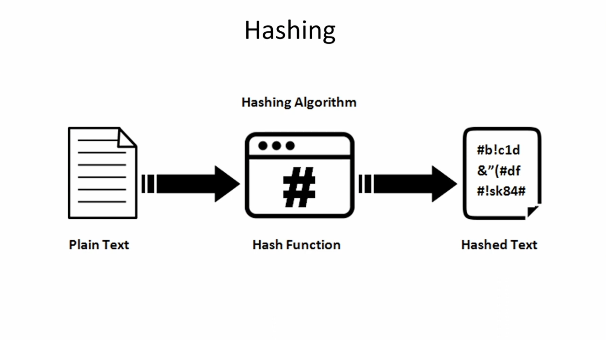

All **Hashing** functions share the following properties:

* **One-way**, it cannot be inferred the original value from the digest.
* **Deterministic**, so the same input will generate the same output (digest) every time the hash is computed.
* Uses **fix size** to generate the final digest: 64, 128, etc.. (the content could be any length)
* **Pseudo Random**: any change to the original content will generate a totally different digest.

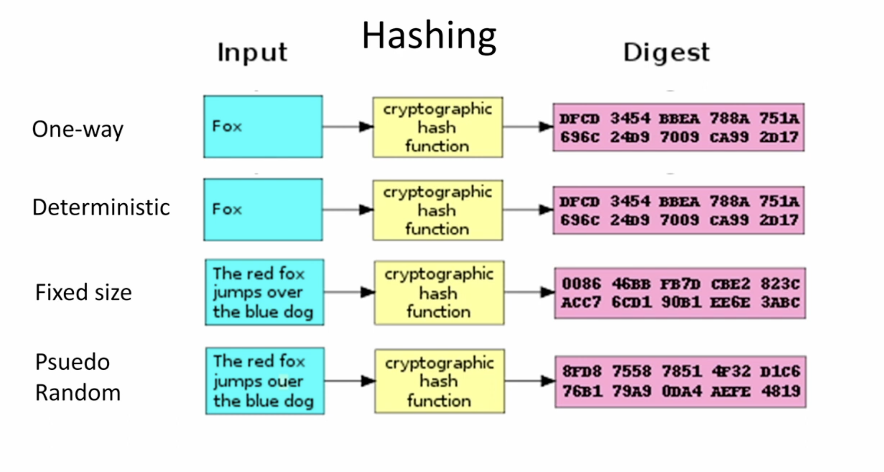

## Algorithms

Following are the most common algorithm that has been used for hashing:

* ~~**MD5 (Message-Digest Algorithm 5)**: It has been deprecated since it has Vulnerabilities, Weak security and Lack of collision resistance, due to the small size of the digest and the  creation of different inputs that produce the same hash value. This makes it unsuitable for applications that require data integrity or security.~~
* ~~**SHA-1 (Secure Hash Algorithm 1)**: The once-widely used algorithm is now easy to crack, making it unsafe to use in security contexts~~
* ~~**CRC-32**: A cyclic redundancy check(CRC) is an error-detecting code often used for detection of accidental changes to data. These days, CRC32 is rarely used outside of Zip files.~~
* **SHA-256**: This algorithm is particularly suited for securing **sensitive data** due to its higher bit length and increased complexity.

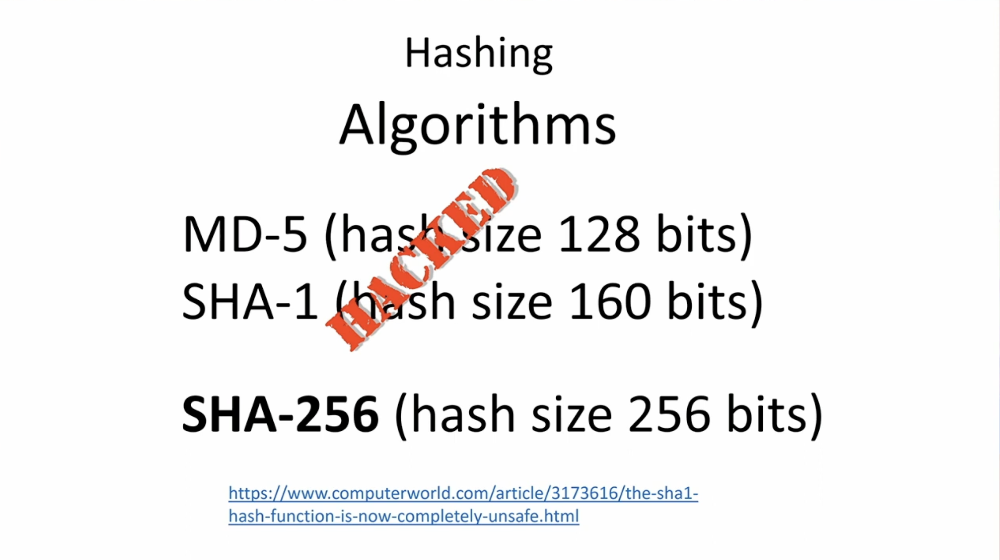

### SHA-256

**SHA-256** calculates a 256-bit hash value for an input message of 512 bits. The real application may need to calculate the hash value for a very long message. In such cases, the message is divided into many **512-bit data blocks**. If the last block is smaller than 512 bits, **padding** is added. The SHA-256 algorithm computes **intermediate** hash values for data blocks one by one, in which the hash result of the **current** block becomes the input **initial** hash for hash computing of the next data block. The result of the final data block is considered to be the **hash value** of the entire message.

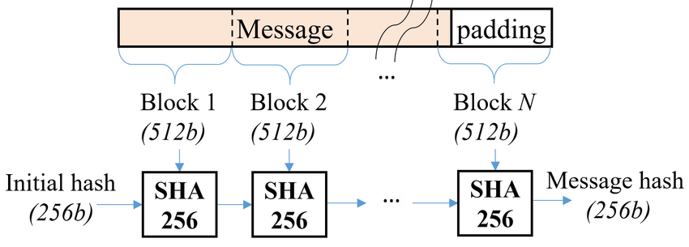

**SHA-256** algorithm provides a secure way to generate a hash digest with the enough complexity to avoid collisions.

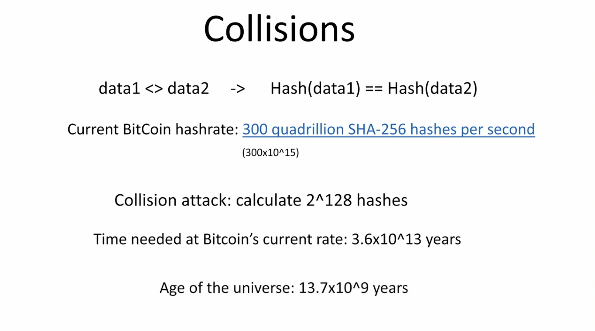

## Applications

### Password verification

Storing all user ***passwords*** as **cleartext** can result in a massive **security breach** if the password file is compromised. One way to reduce this danger is to only **store** the **hash digest** of each password, so when the password is created, this is stored as a digest instead of storing the plain-text or encrypted data. When the user login again, the password is hashed again using the same algorithm and it's compared with the hash stored in the database in order to validated it.

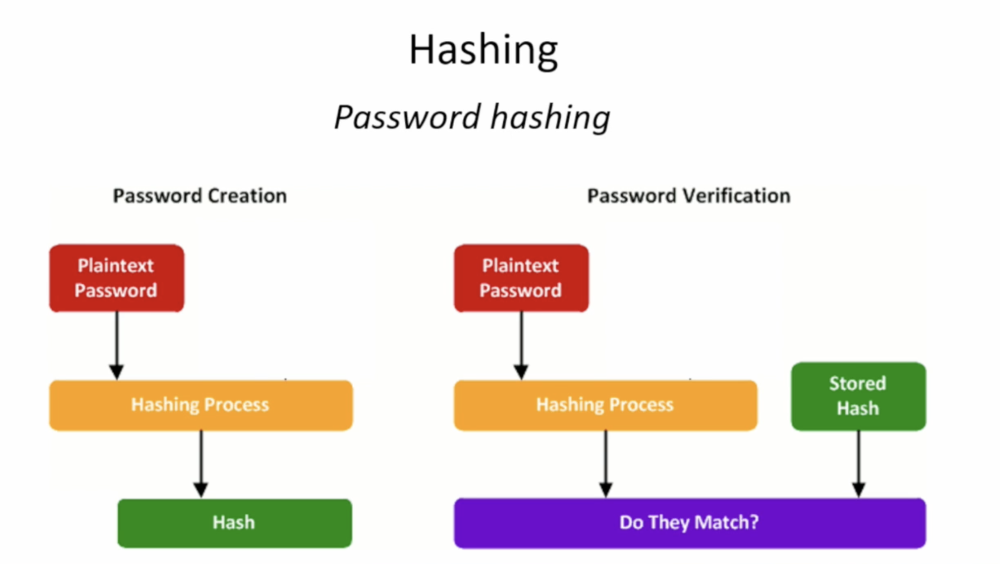

Since the basic hash is **deterministic** it always generates the same output for the same input, this can the easily hacked using a *rainbow table* that store a list of **most used passwords** in order to perform a **brute force attack**.

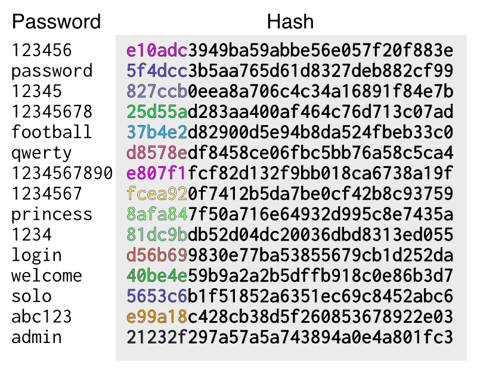

Because of that a **Random Salt** technique is used to avoid this king of attack since in the database the password stored was generated using a salt that perform a transformation that change the digest totally from the original.

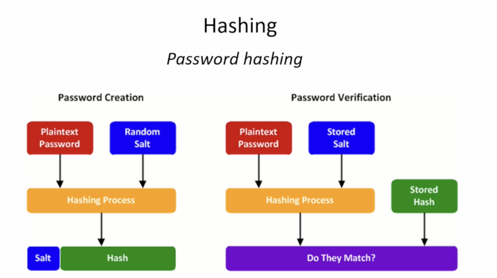

This is the store just the password digest directly into the database versus store the digest with the applied salt information.

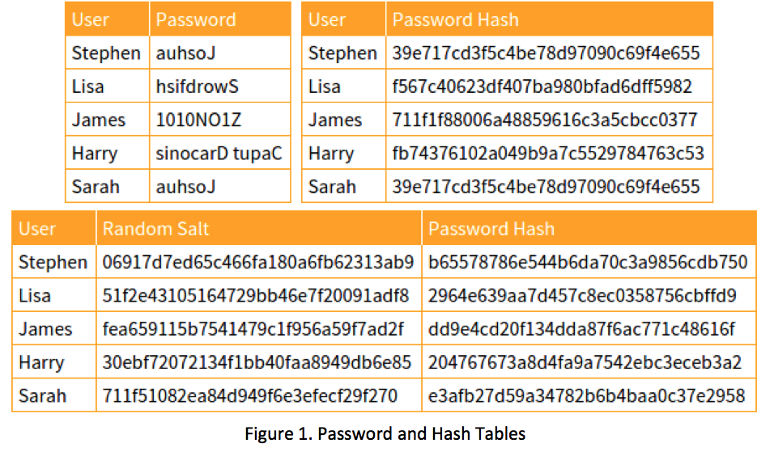

In cryptography and cybersecurity, choosing a password hashing algorithm is crucial for protecting user credentials and sensitive data. There are multiple password hashing algorithm (bcrypt, Argon2, scrypt, and PBKDF2) with their strengths, weaknesses, use cases, and prospects so the algorithm to use depends on the scenario.

#### Bcrypt

**Bcrypt** is a password-hashing function designed by *Niels Provos* and *David Mazières*, based on the Blowfish cipher and presented at USENIX in 1999.[1] Besides incorporating a salt to protect against rainbow table attacks, **bcrypt is an adaptive function over time**, the iteration count can be increased to make it slower, so it remains resistant to brute-force search attacks even with increasing computation power.
  
* Adaptive function with a work factor that can be increased over time
* Built-in salt to protect against rainbow table attacks
* Relatively slow, which is beneficial for password-hashing

#### PBKDF2

**Password-Based Key Derivation Function 2 (PBKDF2)** is part of RSA Laboratories' *Public-Key Cryptography Standards (PKCS)* series. It's widely used and considered a standard in many applications. **PBKDF2** applies a **pseudorandom** function, such as **hash-based message authentication code (HMAC)**, to the input password or passphrase along with a **salt value** and repeats the process many times to produce a derived key, which can then be used as a cryptographic key in subsequent operations. The added computational work makes password cracking much more difficult, and is known as key stretching.

* Applies a **pseudorandom** function to the input password along with a salt
* Uses **key stretching** through **iteration count**
* It can be used with various underlying cryptographic hash functions (e.g., SHA-256)

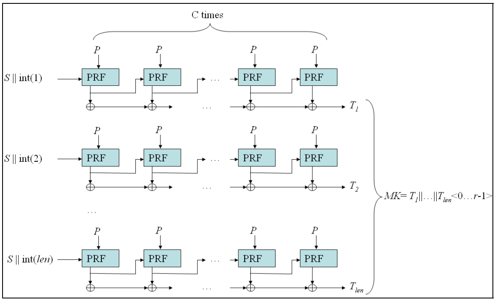

### Proof-of-work

**Proof of work** is a **consensus mechanism** used to confirm that network participants **calculate valid hashes** to verify bitcoin transactions and add the next block to the blockchain. It does so by having other participants in the network verify that the required amount of computing power was used by the miner that is credited with calculating the valid hash. The more miners working to verify transactions (and the faster they can generate hashes), the higher a network's hash rate.

This is an example of block mining, where the hash digest for the transaction block in order to be joined to the blockchain must start with `0000XX`. In order to find a proper hash digest that starts with `0000` the miner must add a value (**nonce**) that iterates over in order to find a proper digest.

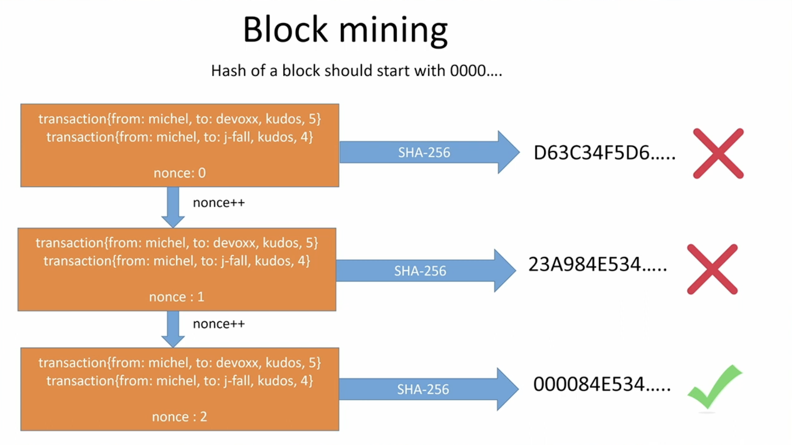

## HMAC

**Hash-based message authentication code (or HMAC)** is a cryptographic authentication technique that uses a **hash function** (*SHA-256*) and a **secret key**. By using **HMAC**, you can achieve **authentication** and **verify** that data is correct and authentic with shared secrets, as **opposed** to approaches that use **signatures** and **asymmetric cryptography**.

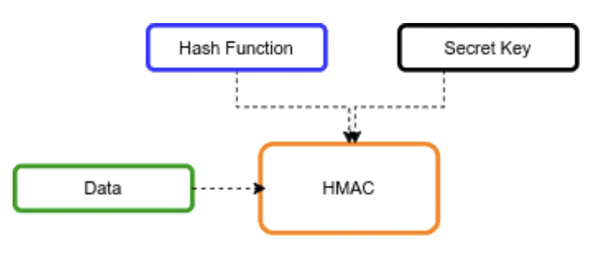

It can be use to check if the message has been modified in the transit by somebody else.

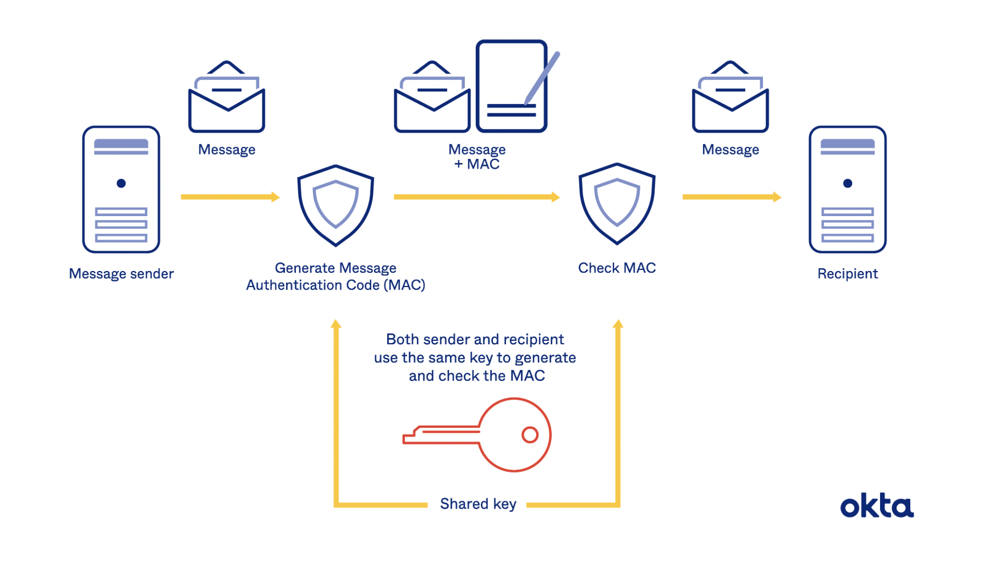

