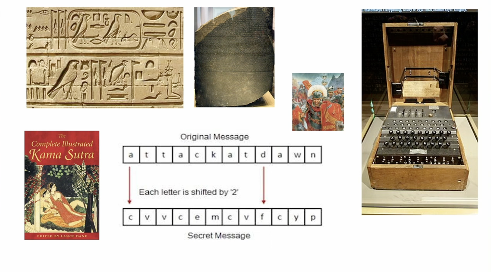
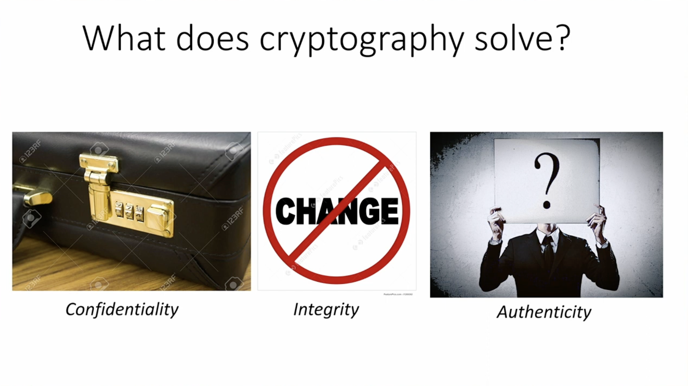
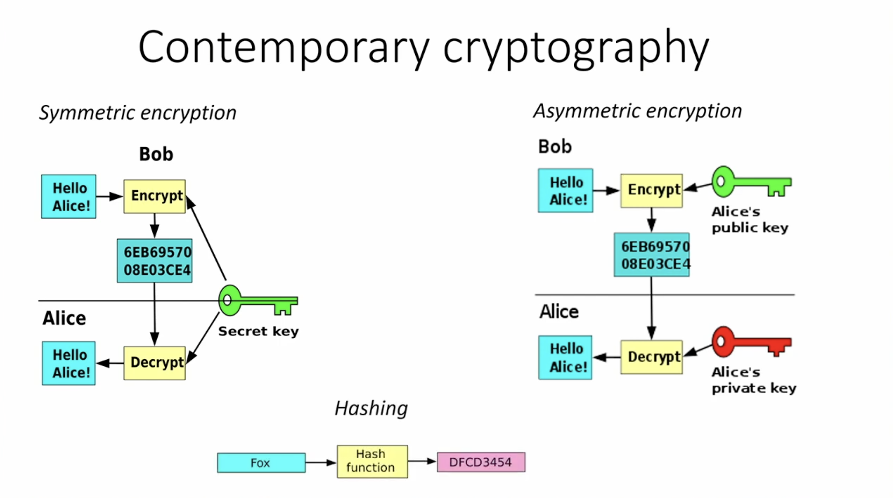

# Cryptography

## Introduction

**Cryptography** is the process of hiding or coding information so that only the person a message was intended for can read it. The art of cryptography has been used to code messages for thousands of years and continues to be used in bank cards, computer passwords, and ecommerce.

## What is Cryptography?

**Cryptography** is the science of providing **security** and **protection** of information. It is used everywhere in our digital world: when you open a Web site, send an email or connect to the WiFi network. That's why developers should have **at least basic understanding of cryptography** and how to use crypto algorithms and crypto libraries, to understand hashing, symmetric and asymmetric ciphers and encryption schemes, as well as digital signatures and the cryptosystems and algorithms behind them.

## What does Cryptography solve?

**Cryptographic** methods try to protect for **confidentiality**, **authenticity**, and **integrity**:

* **Confidentiality** is hiding sensitive information to other people.
* **Integrity** is protecting the data from unauthorized changes.
* **Authenticity** is proving who you are.

## Modern Cryptography

**Cryptography** has evolved from its first attempts (thousands years ago), through the first successful cryptographic algorithms for developers (like the now retired MD5 and DES) to modern crypto algorithms (like SHA-3, Argon2 and ChaCha20).

Key components of cryptography are:

* **Data**: content to be secured(encrypted)
* **Algorithm**: the computational method to encrypt the data
* **Key**: the element needed in order to encrypt/decrypt the data successfully. Also it can be used for validation purposes.

The contemporary ways that uses **cryptography** are:

* **Hashing**: A hash function is any function that can be used to map data of arbitrary size to fixed-size values. The values returned by a hash function are called hash values, hash codes, digests, or simply hashes. Common use cases are **hash functions** (SHA-256, SHA3, RIPEMD and others), **HMAC** (hashed message authentication code), password to **key derivation** functions (like **Scrypt**), the **Diffie-Hellman** key-exchange protocol
* **Symmetric-key encryption**: In Symmetric-key encryption the message is encrypted by using a single key and the same key is used to decrypt the message which makes it easy to use but less secure. It also requires a safe method to transfer the key from one party to another. The most common scheme used is **AES** cipher with CBC and CTR block modes.
* **Asymmetric-key encryption**: Asymmetric key encryption is one of the most common cryptographic methods that involve using a single key and its pendent, where one key is used to encrypt data and the second one is used to decrypt an encrypted text. The second key is kept highly secret, while the first one which is called a public key can be freely distributed among the service’s users. Asymmetric keys most common encryption schemes are the **RSA** cipher and **elliptic curves-based cryptography** (**ECC**), with the *secp256k1* curve and the *Ed25519* cryptosystem.
* **Digital signatures** and **ECDSA**, as well as the concept of **entropy** and secure **random number** generation and **quantum-safe cryptography**.

### Encryption and Keys

Cryptography deals with **storing and transmitting data in a secure way**, such that only those, for whom it is intended, can read and process it. This may involve **encrypting and decrypting data** using symmetric or asymmetric encryption schemes, where one or more **keys** are used to transform data from plain to encrypted form and back.

**Symmetric encryption** (like AES, Twofish and ChaCha20) uses the same key to encrypt and decrypt messages, while **asymmetric encryption** uses a **public-key cryptosystem** (like RSA or ECC) and a key-pair: public key (encryption key) and corresponding private key (decryption key). Encryption algorithms are often combined in encryption schemes (like AES-256-CTR-HMAC-SHA-256, ChaCha20-Poly1305 or ECIES-secp256k1-AES-128-GCM).

Cryptography deals with **keys** (large secret numbers) and in many scenarios these **keys are derived** from numbers, passwords or passphrases using **key derivation algorithms** (like PBKDF2 and Scrypt).

### Digital Signatures and Message Authentication

Cryptography provides means of **digital signing of messages** which guarantee message authenticity, integrity and non-repudiation. Most digital signature algorithms (like DSA, ECDSA and EdDSA) use **asymmetric key pair** (private and public key): the message is **signed** by the private key and the signature is **verified** by the corresponding public key. In the bank systems **digital signatures** are used to sign and approve payments. In blockchain signed transactions allow users to transfer a blockchain asset from one address to another.

Cryptography deals with **message authentication** algorithms (like HMAC) and message authentication codes (MAC codes) to prove message authenticity, integrity and authorship. Authentication is used side by side with encryption, to ensure secure communication.

### Secure Random Numbers

Cryptography uses **random numbers** and deals with **entropy** (unpredictable randomness) and secure generation of random numbers (e.g. using CSPRNG). **Secure random numbers** are unpredictable by nature and developers should care about them, because broken random generator means compromised or hacked system or app.

### Key Exchange

Cryptography defines **key-exchange algorithms** (like **Diffie-Hellman** key exchange and ECDH) and **key establishment schemes**, used to securely establish encryption **keys** between two parties that intend to transmit messages securely using **encryption**. Such algorithms are performed typically when a new secure connection between two parties is established, e.g. when you open a modern Web site or connect to the WiFi network.

### Cryptographic Hashes and Password Hashing

Cryptography provides **cryptographic hash functions** (like SHA-3 and BLAKE2), which transform messages to **message digest** (hash of fixed length), which cannot be reversed back to the original message and almost uniquely identifies the input. In **blockchain** systems, for example, hashes are used to generate blockchain addresses, transaction ID and in many other algorithms and protocols. In **Git** cryptographic hashes are used for generating unique ID for files and commits.

**Password hashing** and password to **key derivation functions** (like Scrypt and Argon2) protect user passwords and password encrypted documents and data by securely deriving a hash (or key) from a text-based passwords, injecting random parameters (salt) and using a lot of iterations and computing resources to make password cracking slow.

### Confusion and Diffusion in Cryptography

In cryptography the hashing, encryption algorithms and random generators follow the Shannon's principles of[ confusion and diffusion](https://en.wikipedia.org/wiki/Confusion\_and\_diffusion). **Confusion** means that each bit in the output form a cipher should depend on several parts of the key and input data and thus direct mapping cannot be established. **Diffusion** means that changing one bit in the input should change approximately half of the bits in the output. These principles are incorporated in most hash functions, MAC algorithms, random number generators, symmetric and asymmetric ciphers.

### Cryptographic Libraries

Developers should know the modern **cryptographic libraries** for their programming language and platform and how to use them. Developing with cryptography requires **understanding of the crypto-concepts**. Copy / pasting code from Internet or following an example from a blog may lead to insecure design and weak security. Cryptographic libraries are very useful, but you should **understand the concepts** first, then choose appropriate combination of algorithms and adjust carefully their parameters.

## Quantum-Resistant Cryptography

Fortunately, researchers have been working to develop public-key algorithms that could **resist** code-breaking efforts from **quantum computers**, preserving or restoring trust in **certificate authorities**, **digital signatures**, and **encrypted messages**.

Notably, the *U.S. National Institute of Standards and Technology* is already evaluating 69 potential **new** methods for what it calls “*post–quantum cryptography.*” The organization expects to have a draft standard by 2024, if not before, which would then be added to web browsers and other internet applications and systems.

In principle, symmetric cryptography can be used for key exchange. But this approach depends on the security of trusted third parties to protect secret keys, and it cannot implement digital signatures, so it would be difficult to apply across the internet. Still, it is used throughout the Global System for Mobile Communication (GSM) cellular standard for encryption and authentication.

Another alternative to public-key cryptography for key exchange is **quantum key-distribution**. Here, quantum methods are used by the sender and receiver to establish a symmetric key. But these methods require special hardware.
