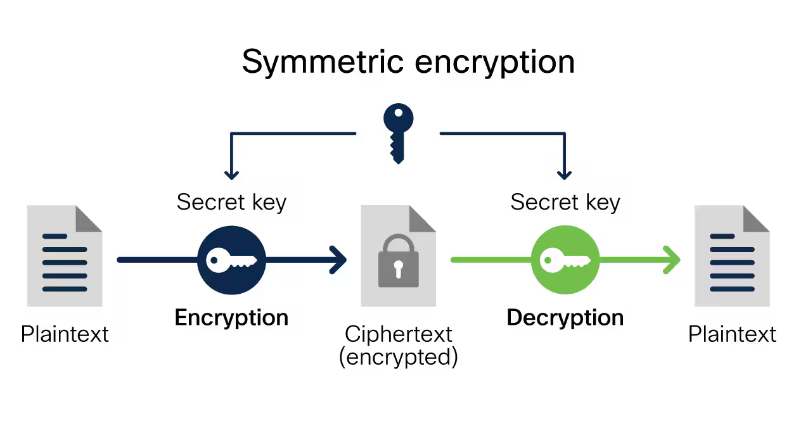
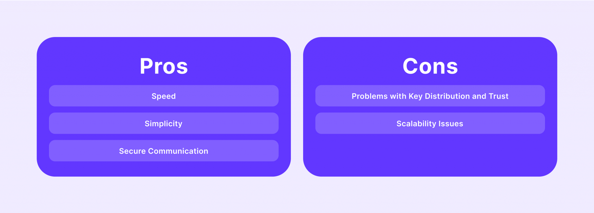
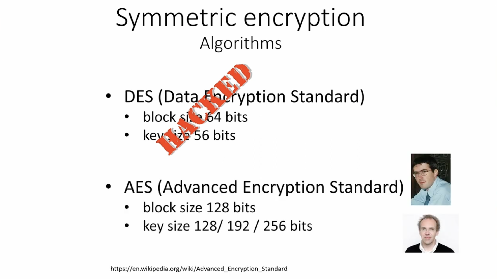
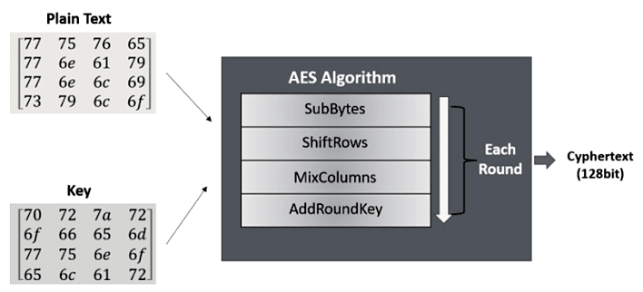
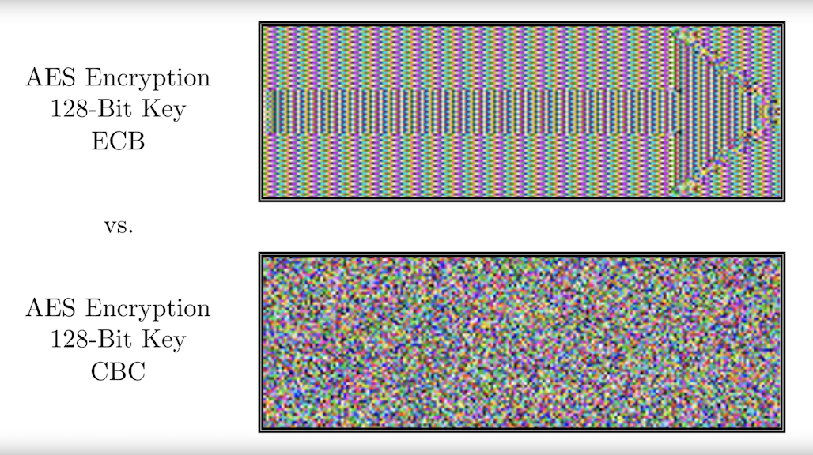
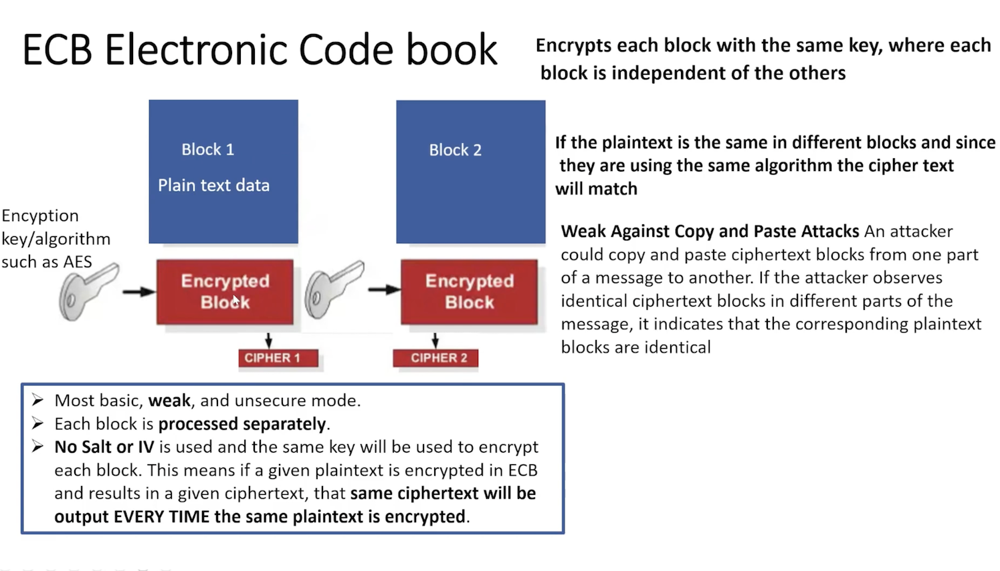
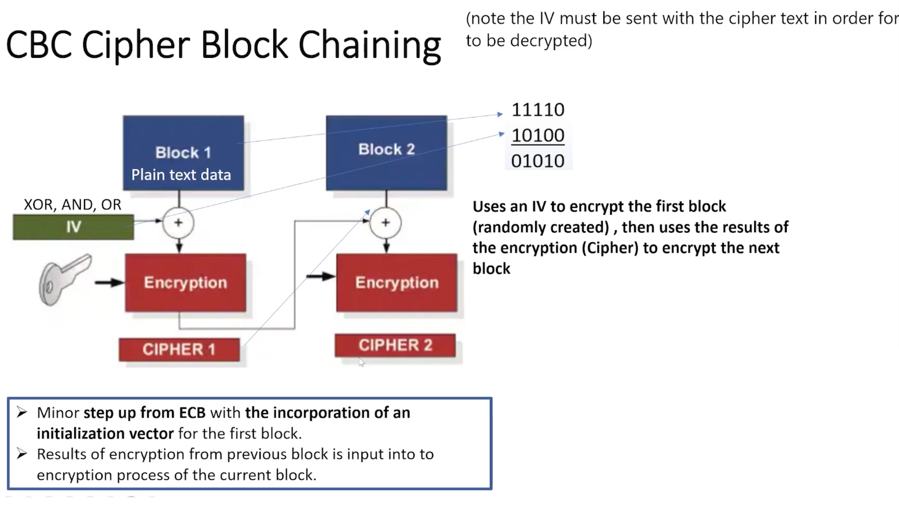
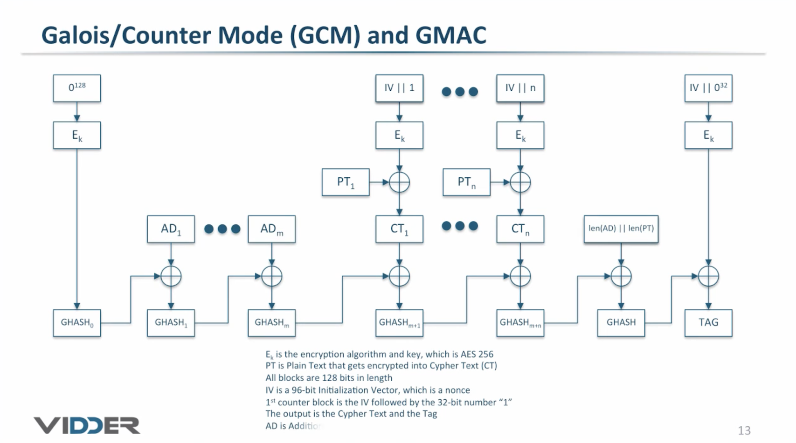
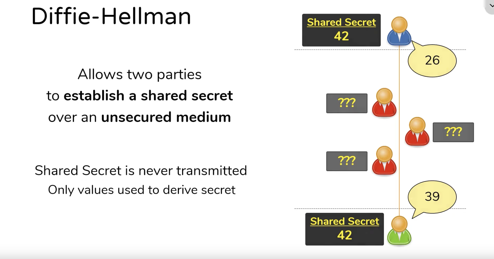
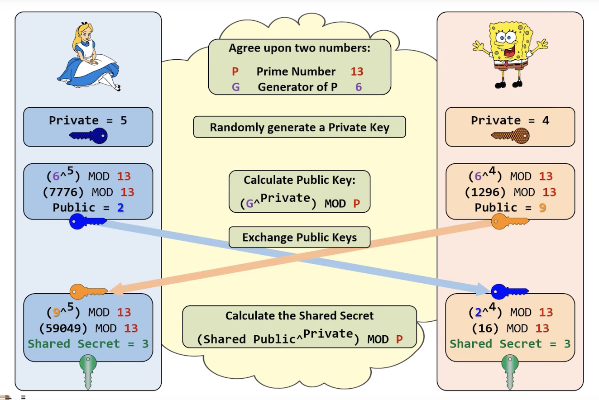

# Symmetric Encryption

**Symmetric encryption** (or *private key* encryption) is the process of using a single key to both **encrypt** and **decrypt** data. It’s called *private key* because the use of a single encryption key necessitates that the key **is always kept private**.

**Symmetric encryption** is often used for **high-volume data** processing where speed, efficiency, and complexity are important. However, due to its nature as a single-key solution, it presents several **security challenges** when it comes to actually **sharing** encrypted data. For this reason, symmetric encryption is often **combined** with **asymmetric encryption** (which uses different keys for encryption and decryption) in many modern secure communication protocols (like Diffie-Hellman).

Generally, **symmetric encryption** works by translating plain text into encoded (cipher) text using an **algorithm** and a **secret key** that is, theoretically, computationally infeasible to crack.

The general process of encryption works as follows:

* **Key Generation**: A **secret key** is generated using **advanced mathematical** equations that is used to encode data. This key is **shared** between sender and receiver to maintain the obfuscation of the data.
* **Encryption**: The **encoding** process uses **complex algorithms** and **random** environmental data (called “entropy”) to transform the original data is usually complex and involves **multiple rounds** of transformation to ensure the ciphertext **is not easily decipherable** without the key.
* **Decryption**: Upon receiving the data, the recipient uses the **same key** to **decode** the data–essentially, **reversing** the process with the key serving as the information needed to “unlock” that data.

Additionally, symmetric encryption algorithms will usually come in one of **two forms**:

* **Stream Ciphers**: Stream ciphers encrypt plaintext messages **one bit at a time**. They create an arbitrarily long keystream of bits, which is then combined with the plaintext bits one by one to produce the ciphertext.
* **Block Ciphers**: Block ciphers take a **chunk**, or **block**, of data and transform it. It then works through the data set **block by block**. Some block ciphers will repeatedly encrypt blocks for added security. Examples of block ciphers are **Advanced Encryption Standard (AES)** or **Data Encryption Standard (DES**).

Some of the key **bonuses** of **symmetric encryption** include:

* **Speed**: Symmetric algorithms are generally **less computationally intensive** as **compared** to their **asymmetric counterparts**. That makes them **faster** and less computationally intensive than asymmetric ones–perfect for **encrypting large amounts of data**.
* **Simplicity**: Symmetric encryption involves only **one key** for both **encryption** and **decryption**, which can **simplify** key management, especially for contexts where key sharing isn’t a major concern.
* **Bandwidth**: Data encoded with symmetric algorithms are generally **smaller in size**, which can help with **bandwidth** concerns if that is an issue.

Many systems or algorithms will **combine** both **symmetric** and **asymmetric** methods in a single process to leverage the **strengths of both**.

## Algorithms

There isn’t a limit on how many encryption algorithms exist. Some of the more popular, or at least well-known, symmetric algorithms around include:

* **Advanced Encryption Standard (AES)**: This is currently one of the **most widely** used symmetric encryption algorithms, supported for **National Security (by NIST)** and industrial applications. There are several different complexities of AES (with 128-bit and 256-bit being the most common) that represent increasing levels of security.
* ~~**Data Encryption Standard (DES)**: Primarily used decades ago, this symmetric algorithm **has effectively been cracked** and is no longer considered secure. It has been deprecated in favor of Triple DES or, in cases of federal or industrial encryption standards, AES.~~
* **Triple DES (3DES)**: This is an extension of the now-defunct DES algorithm that processes plaintext blocks three times for additional security, with a significant tradeoff with performance.
* **Blowfish and Twofish**: These are block ciphers designed as alternatives to DES. Blowfish has a block size of 64 bits, while Twofish has a block size of 128 bits. Twofish was one of the finalists in the competition that selected AES.

Remember, no matter which algorithm or cipher type you use, the security of symmetric encryption **relies heavily on keeping the encryption key secret** and using a **secure method to distribute the key** when necessary.

### AES

The **AES** Encryption algorithm (also known as the *Rijndael algorithm*) is a symmetric block cipher algorithm with a **block/chunk** size of 128 bits. It converts these individual blocks using keys of 128, 192, and 256 bits. Once it encrypts these blocks, it joins them together to form the ciphertext.

!!! note

    The** 256-bit** implementation is the **most secure** length to be used with **AES encryption**.

It is based on a **substitution-permutation network**, also known as an **SP network**. It consists of a series of linked operations, including replacing inputs with specific outputs (substitutions) and others involving bit shuffling (permutations).

The **Advanced Encryption Standard (AES)** encryption process consists of the following steps:

1. The plaintext is **divided** into **blocks**
2. **Add Round Key**: You pass the block data stored in the state array through an XOR function with the first key generated (K0). It passes the resultant state array on as input to the next step.
3. **Sub-Bytes**: In this step, it converts each byte of the state array into hexadecimal, divided into two equal parts. These parts are the rows and columns, mapped with a substitution box (S-Box) to generate new values for the final state array.
4. **Shift Rows**: It swaps the row elements among each other. It skips the first row. It shifts the elements in the second row, one position to the left. It also shifts the elements from the third row two consecutive positions to the left, and it shifts the last row three positions to the left.
5. **Mix Columns**: It multiplies a constant matrix with each column in the state array to get a new column for the subsequent state array. Once all the columns are multiplied with the same constant matrix, you get your state array for the next step. This particular step is not to be done in the last round.
6. **Add Round Key**: The respective key for the round is XOR’d with the state array is obtained in the previous step. If this is the last round, the resultant state array becomes the ciphertext for the specific block; else, it passes as the new state array input for the next round.

The process is **repeated** multiple times, where the number of rounds corresponds to the key length. For example, a 128-bit key requires 10 rounds, while a 256-bit key requires 14 rounds. Once the **final round** is complete, the final ciphertext is **produced**

#### Modes

AES  provides **robust** encryption, however different **operation modes** can **enhance** its functionality and address **specific requirements** in various applications. The different AES operation modes provides unique characteristics and security concerns. There are multiple modes such as ECB, CBC, CFB, OFB, CTR, GCM, XTS among others.

##### ECB

The **Electronic Code Book (ECB)** mode is the **simplest** operation mode for AES. It divides the plaintext into blocks of fixed size and **encrypts each block independently** using the same key. However, this mode has a significant limitation: **identical plaintext blocks result in identical ciphertext blocks**, which may leak information.

##### CBC

**Cipher Block Chaining (CBC)** mode **addresses the vulnerability of ECB mode** by introducing **feedback** from the **previous ciphertext block** into the encryption process. Each plaintext block is **XORed** with the **previous ciphertext block** before encryption, adding **randomness** and **preventing identical plaintext blocks** from producing identical ciphertext blocks.

##### GCM

**Galois Counter Mode (GCM)** **combines** AES encryption with **authentication**, providing both **confidentiality** and **integrity** of the data. It uses a **counter mode** for encryption and an additional authentication tag that verifies the integrity of the ciphertext.

## Applications

Generally speaking, there are a few cases where **symmetric encryption** is **suitable**. Namely, when a system needs to perform **fast encryption**, where there are **large amounts of data to encrypt**, and/or where **key sharing isn’t a concern**.

Within those criteria are several different use cases where symmetric encryption shines:

* **File and Disk Encryption**: For encrypting files, databases, or entire drives, symmetric methods are the gold standard.
* **Bulk Data Encryption**: In situations where large amounts of data need to be encrypted, symmetric encryption is typically the most practical method due to its speed and efficiency compared to asymmetric encryption.
* **Hybrid Algorithms**: While asymmetric solutions solve some critical security issues, they are grossly inefficient when it comes to encrypting data efficiently. Thus hybrid systems will use **asymmetric** approaches to **secure keys** and **verify user identities** while using **symmetric** algorithms to actually **encrypt data**.

The most well-known application of a **hybrid approach** is **Transport Layer Security (TLS)** or the legacy **Secure Socket Layers (SSL)**. These technologies are used as a *tunneling* method to create secure and persistent connection between machines. To accomplish this, SSL and TLS protocols actually use **combinations** of symmetric and asymmetric algorithms to strengthen security.

## Key Exchange

**Key agreement protocols** enable two unknown entities to establish a **shared secret key** and use it to communicate over an insecure channel. One popular key agreement protocol is **Diffie-Hellman**.

### Diffie-Hellman

**Diffie-Hellman (DH)** key exchange is a way of **sharing a secret number** over a **public network**. Allows two parties to establish a shared secret over an unsecured medium. **Secret is never transmitted over the network, only values to derive secret**.

Generally, Diffie-Hellman us used for encryption, **password-authenticated key agreement** and forward security. Password-authenticated key agreements are used to prevent man-in-the-middle (MitM) attacks. Forward secrecy-based protocols protect against the compromising of keys by generating new key pairs for each session.

Diffie-Hellman key exchange is commonly found in security protocols, such as Transport Layer Security (TLS), Secure Shell (SSH) and IP Security (IPsec). For example, in IPsec, the encryption method is used for key generation and key rotation.

